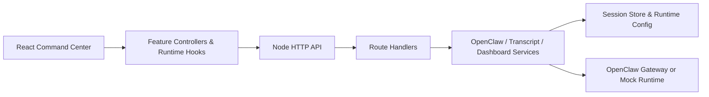

[Read this README in: English](./README.md) | [中文](./README.zh.md) | [繁體中文（香港）](./README.zh-hk.md) | [日本語](./README.ja.md) | [한국어](./README.ko.md) | [Français](./README.fr.md) | [Español](./README.es.md) | [Português](./README.pt.md) | [Deutsch](./README.de.md) | [Bahasa Melayu](./README.ms.md) | [தமிழ்](./README.ta.md)

# LalaClaw

[](https://github.com/aliramw/lalaclaw/actions/workflows/ci.yml)
[](./LICENSE)

A better way to co-create with agents.

Author: Marila Wang

## Highlights

- React + Vite command center UI with chat, timeline, inspector, theme, locale, and attachment flows
- VS Code-style file exploration with separate session/workspace trees, preview actions, and richer document/media handling
- Built-in locale support for 中文, 繁體中文（香港）, English, 日本語, 한국어, Français, Español, Português, Deutsch, Bahasa Melayu, and தமிழ்
- Node.js backend that can connect to local or remote OpenClaw gateways
- Modular frontend and backend boundaries with focused hook- and module-level tests
- CI, linting, coverage thresholds, contribution docs, security policy, and issue templates

## Product Tour

- Top overview bar: agent, model, fast mode, think mode, context, queue, theme, and locale controls
- Main chat workspace: prompt composer, attachment handling, pending turns, markdown rendering, and reset flow
- Inspector panel: timeline, files, artifacts, snapshots, agent activity, and runtime peeks
- Session runtime loop: `mock` mode by default, with optional OpenClaw gateway wiring for live runs

- A longer walkthrough lives in [docs/en/showcase.md](./docs/en/showcase.md)

## Documentation

- Language index: [docs/README.md](./docs/README.md)
- English: [docs/en/documentation.md](./docs/en/documentation.md)
- 中文: [docs/zh/documentation.md](./docs/zh/documentation.md)
- 繁體中文（香港）: [docs/zh-hk/documentation.md](./docs/zh-hk/documentation.md)
- 日本語: [docs/ja/documentation.md](./docs/ja/documentation.md)
- 한국어: [docs/ko/documentation.md](./docs/ko/documentation.md)
- Français: [docs/fr/documentation.md](./docs/fr/documentation.md)
- Español: [docs/es/documentation.md](./docs/es/documentation.md)
- Português: [docs/pt/documentation.md](./docs/pt/documentation.md)
- Deutsch: [docs/de/documentation.md](./docs/de/documentation.md)
- Bahasa Melayu: [docs/ms/documentation.md](./docs/ms/documentation.md)
- தமிழ்: [docs/ta/documentation.md](./docs/ta/documentation.md)

## Architecture



- More structure notes live in [server/README.md](./server/README.md), [src/features/README.md](./src/features/README.md), and [docs/en/architecture.md](./docs/en/architecture.md)

## Quick Start

### Install From npm

For the simplest end-user setup:

```bash
npm install -g lalaclaw@latest
lalaclaw init
```

Then open [http://127.0.0.1:3000](http://127.0.0.1:3000).

Notes:

- `lalaclaw init` writes your local config to `~/.config/lalaclaw/.env.local` on macOS and Linux
- On macOS, `lalaclaw init` also starts a `launchd` background service automatically
- In a source checkout on macOS, `lalaclaw init` builds `dist/` first when needed so the background service can run the production app
- After the macOS background service starts, `lalaclaw init` prompts you to press Enter and opens the App URL in your browser
- If you want config only on macOS, run `lalaclaw init --no-background`
- On Linux, or when you opt out of background startup, continue with `lalaclaw doctor` and `lalaclaw start`
- Use `lalaclaw status` to check the background service, `lalaclaw restart` to restart it, and `lalaclaw stop` to stop it on macOS
- Previewing `doc`, `ppt`, and `pptx` files requires LibreOffice. On macOS, run `lalaclaw doctor --fix` or `brew install --cask libreoffice`

### Install From GitHub

If you want a source checkout for development or local modification:

On a fresh machine with OpenClaw already installed:

```bash
git clone https://github.com/aliramw/lalaclaw.git lalaclaw
cd lalaclaw
npm ci
npm run doctor
npm run lalaclaw:init
```

Then open [http://127.0.0.1:3000](http://127.0.0.1:3000).

Important:

- On macOS, `npm run lalaclaw:init` now tries to build and install the background service for you unless you pass `--no-background`
- `npm run lalaclaw:start` runs in the current terminal and is not a daemon
- If you close that terminal, the service stops and `http://127.0.0.1:3000` becomes unavailable

If you already know your local setup is ready, you can skip `npm run lalaclaw:init`.

If you want to review or regenerate the local config later:

```bash
npm run lalaclaw:init
```

If you prefer to edit configuration manually, start from [.env.local.example](./.env.local.example).

If you want the live development environment instead of the production build:

```bash
npm run dev:all
```

Then open [http://127.0.0.1:5173](http://127.0.0.1:5173).

### Install On A Remote Host Through OpenClaw

If you already have an OpenClaw-managed remote machine and can log in to it with SSH, you can ask OpenClaw to install this project directly from GitHub, let it start the app on the remote host, and then reach the dashboard locally through SSH port forwarding.

Example prompt to OpenClaw:

```text
安装这个 https://github.com/aliramw/lalaclaw
```

Typical flow:

1. OpenClaw clones the repository on the remote machine.
2. OpenClaw installs dependencies and starts LalaClaw on the remote machine.
3. The app listens on `127.0.0.1:3000` on that remote machine.
4. You forward the remote port to your local machine with SSH.
5. You open the forwarded local URL in your browser.

Example SSH port forward:

```bash
ssh -N -L 3000:127.0.0.1:3000 root@your-remote-server-ip
```

Then open:

```text
http://127.0.0.1:3000
```

Notes:

- In this setup, your local `127.0.0.1:3000` is forwarding to the remote machine's `127.0.0.1:3000`
- The app process, OpenClaw config, transcripts, logs, and workspaces all live on the remote machine, not on your local computer
- This is safer than exposing the dashboard directly on the public internet, because otherwise anyone who knows the URL can use the control panel without a password
- If local port `3000` is already in use, you can forward another local port such as `3300:127.0.0.1:3000` and then open `http://127.0.0.1:3300`

### Update LalaClaw

If you installed LalaClaw with npm and want the newest version:

```bash
npm install -g lalaclaw@latest
lalaclaw init
```

If you want a specific published version instead, such as `2026.3.17-7`:

```bash
npm install -g lalaclaw@2026.3.17-7
lalaclaw init
```

If you installed LalaClaw from GitHub, update it like this:

If you already installed LalaClaw from GitHub and want the latest version:

```bash
cd /path/to/lalaclaw
git pull
npm ci
npm run build
npm run lalaclaw:start
```

If you want a specific released version instead, such as `2026.3.17-7`:

```bash
cd /path/to/lalaclaw
git fetch --tags
git checkout 2026.3.17-7
npm ci
npm run build
npm run lalaclaw:start
```

Notes:

- `git pull` updates your local copy to the newest version on GitHub.
- `npm ci` installs the dependencies required by that version.
- `npm run build` refreshes the web app files used by the production server.
- `npm install -g lalaclaw@latest` updates the globally installed npm package.
- If you use the macOS `launchd` setup, restart the service after updating with `launchctl kickstart -k gui/$(id -u)/ai.lalaclaw.app`.
- If Git says you have local changes, back them up or commit them before updating.

### Persistent Production Deploy On macOS

If you want the app to stay online after you close the terminal on macOS, use `launchd`.

1. Build the app first:

```bash
npm ci
npm run doctor
npm run lalaclaw:init
npm run build
```

2. Generate the plist from the checked-in template:

```bash
./deploy/macos/generate-launchd-plist.sh
```

That writes `~/Library/LaunchAgents/ai.lalaclaw.app.plist` and prepares `./logs/`.

3. Load it:

```bash
launchctl bootstrap gui/$(id -u) ~/Library/LaunchAgents/ai.lalaclaw.app.plist
launchctl enable gui/$(id -u)/ai.lalaclaw.app
launchctl kickstart -k gui/$(id -u)/ai.lalaclaw.app
```

That keeps the built app running in the background after logout or terminal close.

Useful follow-up commands:

```bash
launchctl print gui/$(id -u)/ai.lalaclaw.app
launchctl bootout gui/$(id -u) ~/Library/LaunchAgents/ai.lalaclaw.app.plist
tail -f ./logs/lalaclaw-launchd.out.log
tail -f ./logs/lalaclaw-launchd.err.log
```

More detail lives in [deploy/macos/README.md](./deploy/macos/README.md).

## Scripts

- `npm run dev` starts the Vite development server
- `npm run dev:all` starts both the frontend and backend in development mode
- `npm run dev:frontend` starts only the Vite development server
- `npm run dev:backend` starts only the backend server
- `npm run doctor` checks Node.js, OpenClaw discovery, ports, and local config
  For `remote-gateway`, it also probes the configured gateway URL and sends a minimal API request to validate the configured model and agent.
- `npm run doctor -- --fix` installs LibreOffice automatically on macOS when LibreOffice-backed preview support is missing
- `npm run doctor -- --json` prints the same diagnosis as machine-readable JSON with `summary.status` and `summary.exitCode`
- `npm run lalaclaw:init` writes a local `.env.local` bootstrap file
- `npm run lalaclaw:init -- --write-example` copies [`.env.local.example`](./.env.local.example) to your target config path without prompts
- `npm run lalaclaw:start` starts the built app after checking `dist/`
- `npm run lint` runs ESLint across the workspace
- `npm test` runs the Vitest suite once
- `npm run test:coverage` runs Vitest with coverage thresholds and HTML output in `coverage/`
- `npm run test:watch` runs Vitest in watch mode
- `npm run build` creates the production bundle
- `npm start` launches the Node server that serves `dist/`

## Contributing

Contributions are welcome. For larger features, architectural changes, or behavior changes, please open an issue first so the direction can be discussed before implementation.

Before opening a PR:

- keep changes focused and avoid unrelated refactors
- add or update tests for behavior changes
- route new user-facing copy through `src/locales/*.js`
- update docs for user-visible behavior changes
- update [CHANGELOG.md](./CHANGELOG.md) when versioned behavior changes

For the full contribution checklist and project structure notes, see [CONTRIBUTING.md](./CONTRIBUTING.md).

## Development Notes

- Use `npm run dev:all` for the standard local development workflow.
- Use [http://127.0.0.1:5173](http://127.0.0.1:5173) for the Vite app during development.
- Use `npm run lalaclaw:start` or `npm start` only for built output that depends on `dist/`.
- By default, the app auto-detects a local OpenClaw gateway when available.
- To force `mock` mode for reproducible UI or frontend debugging, set `COMMANDCENTER_FORCE_MOCK=1`.
- Before submitting a PR, prefer running `npm run lint`, `npm test`, and the affected build or coverage checks.

## Versioning

LalaClaw uses npm-compatible calendar versioning for releases.

- Update [CHANGELOG.md](./CHANGELOG.md) whenever the project version changes.
- Use npm-compatible calendar versions. For multiple releases on the same day, use `YYYY.M.D-N` such as `2026.3.17-7`, not `YYYY.M.D.N`.
- Call out breaking changes explicitly in release notes and migration-facing docs.
- The repository currently targets Node.js `22` via [`.nvmrc`](./.nvmrc).

## Structure

- Backend layering notes live in [server/README.md](./server/README.md)
- Frontend feature layering notes live in [src/features/README.md](./src/features/README.md)

## Project Quality

- Continuous integration is defined in [`.github/workflows/ci.yml`](./.github/workflows/ci.yml)
- Dependency update automation is defined in [`.github/dependabot.yml`](./.github/dependabot.yml)
- Contribution expectations are documented in [CONTRIBUTING.md](./CONTRIBUTING.md)
- Community expectations are documented in [CODE_OF_CONDUCT.md](./CODE_OF_CONDUCT.md)
- Issue intake is guided by [`.github/ISSUE_TEMPLATE/`](./.github/ISSUE_TEMPLATE)
- Pull request context is guided by [`.github/pull_request_template.md`](./.github/pull_request_template.md)
- Review ownership is defined in [`.github/CODEOWNERS`](./.github/CODEOWNERS)
- The repository license is defined in [LICENSE](./LICENSE)
- Security reporting guidance is documented in [SECURITY.md](./SECURITY.md)
- Ongoing release notes are tracked in [CHANGELOG.md](./CHANGELOG.md)
- The repository targets Node.js `22` via [`.nvmrc`](./.nvmrc)

## OpenClaw wiring

If `~/.openclaw/openclaw.json` exists, LalaClaw will automatically detect your local OpenClaw gateway and reuse its loopback endpoint plus gateway token.

For a fresh machine, the recommended production setup is:

```bash
git clone https://github.com/aliramw/lalaclaw.git lalaclaw
cd lalaclaw
npm ci
npm run doctor
npm run lalaclaw:init
npm run build
npm run lalaclaw:start
```

If you need it to keep running after logout or terminal close on macOS, use `launchd` instead of a plain foreground shell.

If you want to override that and point to another OpenClaw-compatible gateway, set:

```bash
export OPENCLAW_BASE_URL="https://your-openclaw-gateway"
export OPENCLAW_API_KEY="..."
export OPENCLAW_MODEL="openclaw"
export OPENCLAW_AGENT_ID="main"
export OPENCLAW_API_STYLE="chat"
export OPENCLAW_API_PATH="/v1/chat/completions"
node server.js
```

If your gateway is closer to the OpenAI Responses API, use:

```bash
export OPENCLAW_API_STYLE="responses"
export OPENCLAW_API_PATH="/v1/responses"
```

Without these variables, the app runs in `mock` mode so the UI and chat loop remain usable during bootstrap.

To force `mock` mode even when a local `~/.openclaw/openclaw.json` is present, set:

```bash
export COMMANDCENTER_FORCE_MOCK=1
```
