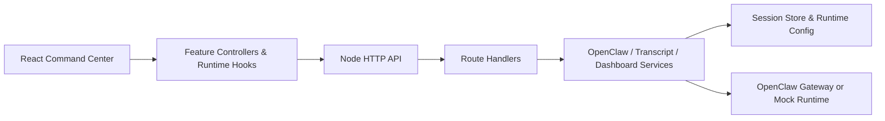

# LalaClaw

[](https://github.com/aliramw/CommandCenter/actions/workflows/ci.yml)
[](./LICENSE)

A better way to co-create with agents.

## Highlights

- React + Vite command center UI with chat, timeline, inspector, theme, locale, and attachment flows
- Built-in locale support for 中文, English, 日本語, Français, Español, and Português
- Node.js backend that can run in `mock` mode or connect to a local OpenClaw gateway
- Modular frontend and backend boundaries with focused hook- and module-level tests
- CI, linting, coverage thresholds, contribution docs, security policy, and issue templates

## Product Tour

- Top overview bar: agent, model, fast mode, think mode, context, queue, theme, and locale controls
- Main chat workspace: prompt composer, attachment handling, pending turns, markdown rendering, and reset flow
- Inspector panel: timeline, files, artifacts, snapshots, agent activity, and runtime peeks
- Session runtime loop: `mock` mode by default, with optional OpenClaw gateway wiring for live runs

- A longer walkthrough lives in [docs/en/showcase.md](./docs/en/showcase.md)

## Architecture



- More structure notes live in [server/README.md](./server/README.md), [src/features/README.md](./src/features/README.md), and [docs/en/architecture.md](./docs/en/architecture.md)

## Quick Start

```bash
npm ci
npm run lint
npm test
npm run test:coverage
npm run build
node server.js
```

Then open [http://127.0.0.1:3000](http://127.0.0.1:3000).

## Scripts

- `npm run dev` starts the Vite development server
- `npm run lint` runs ESLint across the workspace
- `npm test` runs the Vitest suite once
- `npm run test:coverage` runs Vitest with coverage thresholds and HTML output in `coverage/`
- `npm run test:watch` runs Vitest in watch mode
- `npm run build` creates the production bundle
- `npm start` launches the Node server that serves `dist/`

## Structure

- Backend layering notes live in [server/README.md](./server/README.md)
- Frontend feature layering notes live in [src/features/README.md](./src/features/README.md)

## Project Quality

- Continuous integration is defined in [`.github/workflows/ci.yml`](./.github/workflows/ci.yml)
- Dependency update automation is defined in [`.github/dependabot.yml`](./.github/dependabot.yml)
- Contribution expectations are documented in [CONTRIBUTING.md](./CONTRIBUTING.md)
- The repository license is defined in [LICENSE](./LICENSE)
- Security reporting guidance is documented in [SECURITY.md](./SECURITY.md)
- Ongoing release notes are tracked in [CHANGELOG.md](./CHANGELOG.md)
- The repository targets Node.js `22` via [`.nvmrc`](./.nvmrc)

## OpenClaw wiring

If `~/.openclaw/openclaw.json` exists, CommandCenter will automatically detect your local OpenClaw gateway and reuse its loopback endpoint plus gateway token.

If you want to override that and point to another OpenClaw-compatible gateway, set:

```bash
export OPENCLAW_BASE_URL="https://your-openclaw-gateway"
export OPENCLAW_API_KEY="..."
export OPENCLAW_MODEL="openclaw"
export OPENCLAW_AGENT_ID="main"
export OPENCLAW_API_STYLE="chat"
export OPENCLAW_API_PATH="/v1/chat/completions"
node server.js
```

If your gateway is closer to the OpenAI Responses API, use:

```bash
export OPENCLAW_API_STYLE="responses"
export OPENCLAW_API_PATH="/v1/responses"
```

Without these variables, the app runs in `mock` mode so the UI and chat loop remain usable during bootstrap.

To force `mock` mode even when a local `~/.openclaw/openclaw.json` is present, set:

```bash
export COMMANDCENTER_FORCE_MOCK=1
```
