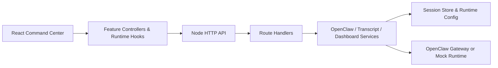

# LalaClaw

[](https://github.com/aliramw/CommandCenter/actions/workflows/ci.yml)
[](./LICENSE)

A better way to co-create with agents.

## Highlights

- React + Vite command center UI with chat, timeline, inspector, theme, locale, and attachment flows
- Built-in locale support for 中文, English, 日本語, Français, Español, and Português
- Node.js backend that can run in `mock` mode or connect to a local OpenClaw gateway
- Modular frontend and backend boundaries with focused hook- and module-level tests
- CI, linting, coverage thresholds, contribution docs, security policy, and issue templates

## Product Tour

- Top overview bar: agent, model, fast mode, think mode, context, queue, theme, and locale controls
- Main chat workspace: prompt composer, attachment handling, pending turns, markdown rendering, and reset flow
- Inspector panel: timeline, files, artifacts, snapshots, agent activity, and runtime peeks
- Session runtime loop: `mock` mode by default, with optional OpenClaw gateway wiring for live runs

- A longer walkthrough lives in [docs/en/showcase.md](./docs/en/showcase.md)

## Documentation

- Language index: [docs/README.md](./docs/README.md)
- English: [docs/en/documentation.md](./docs/en/documentation.md)
- 中文: [docs/zh/documentation.md](./docs/zh/documentation.md)
- 日本語: [docs/ja/documentation.md](./docs/ja/documentation.md)
- Français: [docs/fr/documentation.md](./docs/fr/documentation.md)
- Español: [docs/es/documentation.md](./docs/es/documentation.md)
- Português: [docs/pt/documentation.md](./docs/pt/documentation.md)

## Architecture



- More structure notes live in [server/README.md](./server/README.md), [src/features/README.md](./src/features/README.md), and [docs/en/architecture.md](./docs/en/architecture.md)

## Quick Start

### Install From GitHub

On a fresh machine with OpenClaw already installed:

```bash
git clone https://github.com/aliramw/CommandCenter.git lalaclaw
cd lalaclaw
npm ci
npm run doctor
npm run lalaclaw:init
npm run build
npm run lalaclaw:start
```

Then open [http://127.0.0.1:3000](http://127.0.0.1:3000).

Important:

- `npm run lalaclaw:start` runs in the current terminal and is not a daemon
- If you close that terminal, the service stops and `http://127.0.0.1:3000` becomes unavailable

If you already know your local setup is ready, you can skip `npm run lalaclaw:init`.

If you want to review or regenerate the local config later:

```bash
npm run lalaclaw:init
```

If you prefer to edit configuration manually, start from [.env.local.example](./.env.local.example).

If you want the live development environment instead of the production build:

```bash
npm run dev:all
```

Then open [http://127.0.0.1:5173](http://127.0.0.1:5173).

### Persistent Production Deploy On macOS

If you want the app to stay online after you close the terminal on macOS, use `launchd`.

1. Build the app first:

```bash
npm ci
npm run doctor
npm run lalaclaw:init
npm run build
```

2. Generate the plist from the checked-in template:

```bash
./deploy/macos/generate-launchd-plist.sh
```

That writes `~/Library/LaunchAgents/ai.lalaclaw.app.plist` and prepares `./logs/`.

3. Load it:

```bash
launchctl bootstrap gui/$(id -u) ~/Library/LaunchAgents/ai.lalaclaw.app.plist
launchctl enable gui/$(id -u)/ai.lalaclaw.app
launchctl kickstart -k gui/$(id -u)/ai.lalaclaw.app
```

That keeps the built app running in the background after logout or terminal close.

Useful follow-up commands:

```bash
launchctl print gui/$(id -u)/ai.lalaclaw.app
launchctl bootout gui/$(id -u) ~/Library/LaunchAgents/ai.lalaclaw.app.plist
tail -f ./logs/lalaclaw-launchd.out.log
tail -f ./logs/lalaclaw-launchd.err.log
```

More detail lives in [deploy/macos/README.md](./deploy/macos/README.md).

## Scripts

- `npm run dev` starts the Vite development server
- `npm run dev:all` starts both the frontend and backend in development mode
- `npm run dev:frontend` starts only the Vite development server
- `npm run dev:backend` starts only the backend server
- `npm run doctor` checks Node.js, OpenClaw discovery, ports, and local config
  For `remote-gateway`, it also probes the configured gateway URL and sends a minimal API request to validate the configured model and agent.
- `npm run doctor -- --json` prints the same diagnosis as machine-readable JSON with `summary.status` and `summary.exitCode`
- `npm run lalaclaw:init` writes a local `.env.local` bootstrap file
- `npm run lalaclaw:init -- --write-example` copies [`.env.local.example`](./.env.local.example) to your target config path without prompts
- `npm run lalaclaw:start` starts the built app after checking `dist/`
- `npm run lint` runs ESLint across the workspace
- `npm test` runs the Vitest suite once
- `npm run test:coverage` runs Vitest with coverage thresholds and HTML output in `coverage/`
- `npm run test:watch` runs Vitest in watch mode
- `npm run build` creates the production bundle
- `npm start` launches the Node server that serves `dist/`

## Structure

- Backend layering notes live in [server/README.md](./server/README.md)
- Frontend feature layering notes live in [src/features/README.md](./src/features/README.md)

## Project Quality

- Continuous integration is defined in [`.github/workflows/ci.yml`](./.github/workflows/ci.yml)
- Dependency update automation is defined in [`.github/dependabot.yml`](./.github/dependabot.yml)
- Contribution expectations are documented in [CONTRIBUTING.md](./CONTRIBUTING.md)
- The repository license is defined in [LICENSE](./LICENSE)
- Security reporting guidance is documented in [SECURITY.md](./SECURITY.md)
- Ongoing release notes are tracked in [CHANGELOG.md](./CHANGELOG.md)
- The repository targets Node.js `22` via [`.nvmrc`](./.nvmrc)

## OpenClaw wiring

If `~/.openclaw/openclaw.json` exists, CommandCenter will automatically detect your local OpenClaw gateway and reuse its loopback endpoint plus gateway token.

For a fresh machine, the recommended production setup is:

```bash
git clone https://github.com/aliramw/CommandCenter.git lalaclaw
cd lalaclaw
npm ci
npm run doctor
npm run lalaclaw:init
npm run build
npm run lalaclaw:start
```

If you need it to keep running after logout or terminal close on macOS, use `launchd` instead of a plain foreground shell.

If you want to override that and point to another OpenClaw-compatible gateway, set:

```bash
export OPENCLAW_BASE_URL="https://your-openclaw-gateway"
export OPENCLAW_API_KEY="..."
export OPENCLAW_MODEL="openclaw"
export OPENCLAW_AGENT_ID="main"
export OPENCLAW_API_STYLE="chat"
export OPENCLAW_API_PATH="/v1/chat/completions"
node server.js
```

If your gateway is closer to the OpenAI Responses API, use:

```bash
export OPENCLAW_API_STYLE="responses"
export OPENCLAW_API_PATH="/v1/responses"
```

Without these variables, the app runs in `mock` mode so the UI and chat loop remain usable during bootstrap.

To force `mock` mode even when a local `~/.openclaw/openclaw.json` is present, set:

```bash
export COMMANDCENTER_FORCE_MOCK=1
```
