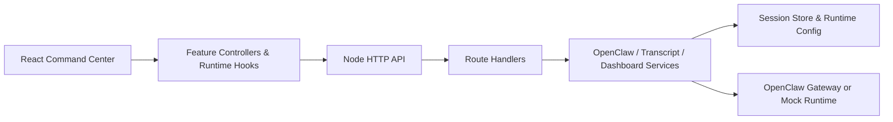

# LalaClaw

[English README](./README.md)

[](https://github.com/aliramw/lalaclaw/actions/workflows/ci.yml)
[](./LICENSE)

一种更适合与 Agent 协作共创的方式。

## 亮点

- 基于 React + Vite 的 command center 界面，包含对话、时间线、检查器、主题、语言和附件工作流
- 内置中文、English、日本語、Français、Español 和 Português 界面支持
- Node.js 后端既可以连接本地 OpenClaw 网关，也可以连接远端 OpenClaw 网关
- 前后端结构模块化，配有针对性的 hook 和模块级测试
- 内置 CI、lint、覆盖率阈值、贡献文档、安全策略和 issue 模板

## 产品导览

- 顶部概览栏：Agent、模型、快速模式、思考模式、上下文、队列、主题和语言控制
- 主对话区：提示词输入、附件处理、进行中轮次、Markdown 渲染和重置会话
- 右侧检查器：时间线、文件、产物、快照、Agent 活动和运行时信息
- 会话运行循环：默认可用 `mock` 模式，也可以接入 OpenClaw 网关执行真实任务

- 更完整的演示说明见 [docs/zh/showcase.md](./docs/zh/showcase.md)

## 文档

- 语言索引：[docs/README.md](./docs/README.md)
- English: [docs/en/documentation.md](./docs/en/documentation.md)
- 中文: [docs/zh/documentation.md](./docs/zh/documentation.md)
- 日本語: [docs/ja/documentation.md](./docs/ja/documentation.md)
- Français: [docs/fr/documentation.md](./docs/fr/documentation.md)
- Español: [docs/es/documentation.md](./docs/es/documentation.md)
- Português: [docs/pt/documentation.md](./docs/pt/documentation.md)

## 架构



- 更多结构说明见 [server/README.md](./server/README.md)、[src/features/README.md](./src/features/README.md) 和 [docs/zh/architecture.md](./docs/zh/architecture.md)

## 快速开始

### 从 npm 安装

如果你是普通用户，最简单的安装方式是：

```bash
npm install -g lalaclaw
lalaclaw init
lalaclaw doctor
lalaclaw start
```

然后打开 [http://127.0.0.1:3000](http://127.0.0.1:3000)。

说明：

- `lalaclaw init` 会在 macOS 和 Linux 上把本地配置写到 `~/.config/lalaclaw/.env.local`
- `lalaclaw doctor` 会检查 Node.js、OpenClaw 探测、端口和本地配置
- `lalaclaw start` 会占用当前终端运行，关闭终端后服务会停止

### 从 GitHub 安装

如果你希望拿到源码，用于开发或本地修改：

如果你在一台已经安装好 OpenClaw 的新机器上使用：

```bash
git clone https://github.com/aliramw/lalaclaw.git lalaclaw
cd lalaclaw
npm ci
npm run doctor
npm run lalaclaw:init
npm run build
npm run lalaclaw:start
```

然后打开 [http://127.0.0.1:3000](http://127.0.0.1:3000)。

注意：

- `npm run lalaclaw:start` 会占用当前终端运行，不是后台守护进程
- 如果你关闭这个终端，服务会停止，`http://127.0.0.1:3000` 也会不可用

如果你已经确认本地配置没有问题，可以跳过 `npm run lalaclaw:init`。

如果你之后想重新检查或生成本地配置：

```bash
npm run lalaclaw:init
```

如果你更喜欢手动编辑配置，可以从 [.env.local.example](./.env.local.example) 开始。

如果你想运行实时开发环境，而不是生产构建：

```bash
npm run dev:all
```

然后打开 [http://127.0.0.1:5173](http://127.0.0.1:5173)。

### 更新 LalaClaw

如果你是通过 npm 安装的，想更新到最新版：

```bash
npm install -g lalaclaw@latest
lalaclaw doctor
lalaclaw start
```

如果你想切换到某个指定发布版本，比如 `2026.3.17-2`：

```bash
npm install -g lalaclaw@2026.3.17-2
lalaclaw doctor
lalaclaw start
```

如果你是从 GitHub 安装的，请按下面方式更新：

如果你已经从 GitHub 安装过 LalaClaw，想更新到最新版本：

```bash
cd /path/to/lalaclaw
git pull
npm ci
npm run build
npm run lalaclaw:start
```

如果你想切换到某个指定发布版本，比如 `2026.3.17-2`：

```bash
cd /path/to/lalaclaw
git fetch --tags
git checkout 2026.3.17-2
npm ci
npm run build
npm run lalaclaw:start
```

说明：

- `git pull` 会把你本地的代码更新到 GitHub 上的最新版本
- `npm ci` 会安装这个版本对应的依赖
- `npm run build` 会刷新生产模式使用的前端文件
- `npm install -g lalaclaw@latest` 会更新全局安装的 npm 包
- 如果你使用 macOS 的 `launchd` 常驻运行，更新后请执行 `launchctl kickstart -k gui/$(id -u)/ai.lalaclaw.app` 重启服务
- 如果 Git 提示你有本地改动，请先备份或提交这些改动，再执行更新

### 在 macOS 上常驻运行生产服务

如果你希望关闭终端后应用依然在线，可以使用 `launchd`。

1. 先构建应用：

```bash
npm ci
npm run doctor
npm run lalaclaw:init
npm run build
```

2. 使用仓库里提供的模板生成 plist：

```bash
./deploy/macos/generate-launchd-plist.sh
```

这会写入 `~/Library/LaunchAgents/ai.lalaclaw.app.plist`，并准备好 `./logs/`。

3. 加载服务：

```bash
launchctl bootstrap gui/$(id -u) ~/Library/LaunchAgents/ai.lalaclaw.app.plist
launchctl enable gui/$(id -u)/ai.lalaclaw.app
launchctl kickstart -k gui/$(id -u)/ai.lalaclaw.app
```

这样即使你退出登录或关闭终端，构建后的应用也会继续在后台运行。

常用后续命令：

```bash
launchctl print gui/$(id -u)/ai.lalaclaw.app
launchctl bootout gui/$(id -u) ~/Library/LaunchAgents/ai.lalaclaw.app.plist
tail -f ./logs/lalaclaw-launchd.out.log
tail -f ./logs/lalaclaw-launchd.err.log
```

更多细节见 [deploy/macos/README.md](./deploy/macos/README.md)。

## 脚本

- `npm run dev` 启动 Vite 开发服务器
- `npm run dev:all` 同时启动前端和后端开发环境
- `npm run dev:frontend` 仅启动 Vite 开发服务器
- `npm run dev:backend` 仅启动后端服务
- `npm run doctor` 检查 Node.js、OpenClaw 探测、端口和本地配置
  对 `remote-gateway` 模式，它还会探测配置的网关 URL，并发送最小 API 请求验证模型和 Agent 配置
- `npm run doctor -- --json` 以机器可读的 JSON 形式输出同样的诊断结果，包含 `summary.status` 和 `summary.exitCode`
- `npm run lalaclaw:init` 写入本地 `.env.local` 引导配置
- `npm run lalaclaw:init -- --write-example` 把 [`.env.local.example`](./.env.local.example) 复制到目标配置路径，不会进入交互提示
- `npm run lalaclaw:start` 在检查 `dist/` 后启动构建版应用
- `npm run lint` 运行 ESLint
- `npm test` 运行一次 Vitest 测试
- `npm run test:coverage` 运行带覆盖率阈值和 HTML 输出的 Vitest，结果在 `coverage/`
- `npm run test:watch` 以 watch 模式运行 Vitest
- `npm run build` 构建生产包
- `npm start` 启动用于提供 `dist/` 的 Node 服务

## 贡献

欢迎贡献。对于较大的功能、架构调整或用户可见行为变化，建议先开一个 issue 讨论方向，再开始实现。

在提交 PR 前：

- 保持改动聚焦，避免顺手做无关重构
- 对行为变化补充或更新测试
- 新增用户可见文案请走 `src/locales/*.js`
- 用户可见行为变化时同步更新文档
- 版本化行为变化时更新 [CHANGELOG.md](./CHANGELOG.md)

完整的贡献清单和项目结构说明见 [CONTRIBUTING.md](./CONTRIBUTING.md)。

## 开发说明

- 标准本地开发流程使用 `npm run dev:all`
- 开发时访问 [http://127.0.0.1:5173](http://127.0.0.1:5173)
- 只有依赖 `dist/` 的构建产物时，才使用 `npm run lalaclaw:start` 或 `npm start`
- 默认情况下，应用会自动探测本地 OpenClaw 网关
- 如果你想稳定复现 UI 或前端问题，可以设置 `COMMANDCENTER_FORCE_MOCK=1` 强制 `mock` 模式
- 提交 PR 前，建议至少运行 `npm run lint`、`npm test` 和受影响的构建或覆盖率检查

## 版本约定

LalaClaw 使用语义化版本。

- 每次项目版本变化时更新 [CHANGELOG.md](./CHANGELOG.md)
- 使用 npm 兼容的日历版本格式。同一天的第 N 个版本使用 `YYYY.M.D-N`，例如 `2026.3.17-2`，不要使用 `YYYY.M.D.N`
- 破坏性变更应在 release notes 和迁移文档里明确标注
- 当前仓库目标 Node.js 版本是 [`.nvmrc`](./.nvmrc) 中的 `22`

## 结构

- 后端分层说明见 [server/README.md](./server/README.md)
- 前端 feature 分层说明见 [src/features/README.md](./src/features/README.md)

## 项目质量

- 持续集成定义在 [`.github/workflows/ci.yml`](./.github/workflows/ci.yml)
- 依赖更新自动化定义在 [`.github/dependabot.yml`](./.github/dependabot.yml)
- 贡献约定见 [CONTRIBUTING.md](./CONTRIBUTING.md)
- 社区行为约定见 [CODE_OF_CONDUCT.md](./CODE_OF_CONDUCT.md)
- Issue 提交流程见 [`.github/ISSUE_TEMPLATE/`](./.github/ISSUE_TEMPLATE)
- PR 上下文模板见 [`.github/pull_request_template.md`](./.github/pull_request_template.md)
- 评审归属定义见 [`.github/CODEOWNERS`](./.github/CODEOWNERS)
- 仓库许可证见 [LICENSE](./LICENSE)
- 安全上报说明见 [SECURITY.md](./SECURITY.md)
- 持续更新的 release notes 见 [CHANGELOG.md](./CHANGELOG.md)
- 当前仓库目标 Node.js 版本见 [`.nvmrc`](./.nvmrc)

## OpenClaw 接入

如果 `~/.openclaw/openclaw.json` 存在，LalaClaw 会自动探测本地 OpenClaw 网关，并复用其中的回环地址和网关令牌。

对于新机器，推荐的生产环境初始化流程是：

```bash
git clone https://github.com/aliramw/lalaclaw.git lalaclaw
cd lalaclaw
npm ci
npm run doctor
npm run lalaclaw:init
npm run build
npm run lalaclaw:start
```

如果你希望在退出登录或关闭终端后继续运行，请在 macOS 上使用 `launchd`，而不是普通前台终端。

如果你想手动接入另一个 OpenClaw 兼容网关，可以设置：

```bash
export OPENCLAW_BASE_URL="https://your-openclaw-gateway"
export OPENCLAW_API_KEY="..."
export OPENCLAW_MODEL="openclaw"
export OPENCLAW_AGENT_ID="main"
export OPENCLAW_API_STYLE="chat"
export OPENCLAW_API_PATH="/v1/chat/completions"
node server.js
```

如果你的网关更接近 OpenAI Responses API，可以使用：

```bash
export OPENCLAW_API_STYLE="responses"
export OPENCLAW_API_PATH="/v1/responses"
```

如果没有设置这些变量，应用会运行在 `mock` 模式，这样在初始化阶段也可以完整体验界面和对话流程。

如果即使存在本地 `~/.openclaw/openclaw.json` 也想强制使用 `mock` 模式，请设置：

```bash
export COMMANDCENTER_FORCE_MOCK=1
```
