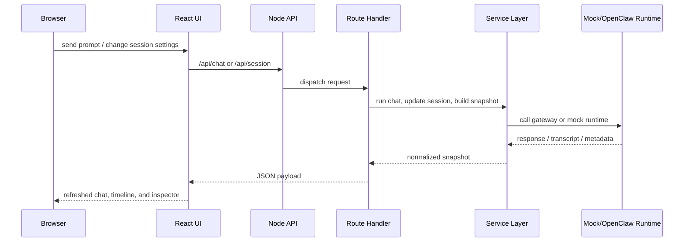

[English](../en/architecture.md) | [中文](../zh/architecture.md) | [日本語](../ja/architecture.md) | [Français](../fr/architecture.md) | [Español](../es/architecture.md) | [Português](../pt/architecture.md)

# Architecture Overview

> Navigation: [Documentation Home](./documentation.md) | [Quick Start](./documentation-quick-start.md) | [Interface Overview](./documentation-interface.md) | [Product Showcase](./showcase.md) | [Refactor Roadmap](./refactor-roadmap.md)

LalaClaw is organized around a thin UI entrypoint, a thin server entrypoint, and testable modules between them.

## Frontend

- `src/App.jsx` is the page shell
- `src/features/app/controllers/` coordinates page-level behavior
- `src/features/chat/controllers/` manages composer and chat execution flow
- `src/features/session/runtime/` manages runtime polling and snapshot hydration
- `src/features/*/storage`, `state`, and `utils` keep persistence and pure helpers isolated

## Backend

- `server.js` boots the app and delegates to the assembled context
- `server/core/` owns runtime config and session storage foundations
- `server/routes/` owns API request handling
- `server/services/` owns OpenClaw transport, transcript projection, and dashboard assembly
- `server/formatters/` owns pure parsing and formatting helpers
- `server/http/` owns response and body utilities

## Request Flow

## Quality Guardrails

- ESLint is the default static check
- Vitest covers UI hooks, UI components, routes, services, and formatting modules
- Coverage thresholds run in CI
- `mock` mode remains the default-safe path for local and automated testing
