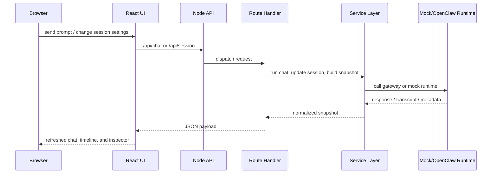

[English](../en/architecture.md) | [中文](../zh/architecture.md) | [日本語](../ja/architecture.md) | [Français](../fr/architecture.md) | [Español](../es/architecture.md) | [Português](../pt/architecture.md)

# アーキテクチャ概要

> Navigation: [Documentation Home](./documentation.md) | [クイックスタート](./documentation-quick-start.md) | [画面概要](./documentation-interface.md) | [プロダクトショーケース](./showcase.md) | [リファクタリングロードマップ](./refactor-roadmap.md)

LalaClaw は、薄い UI 入口、薄いサーバー入口、その間にあるテストしやすいモジュール群で構成されています。

## フロントエンド

- `src/App.jsx` はページシェル
- `src/features/app/controllers/` はページレベルの振る舞いを調整する
- `src/features/chat/controllers/` は composer と chat 実行フローを扱う
- `src/features/session/runtime/` は runtime polling と snapshot hydration を扱う
- `src/features/*/storage`、`state`、`utils` は persistence と純粋な helper を分離する

## バックエンド

- `server.js` はアプリを起動し、組み上げられた context に委譲する
- `server/core/` は runtime config と session store の基盤を持つ
- `server/routes/` は API request handling を担う
- `server/services/` は OpenClaw transport、transcript projection、dashboard assembly を担う
- `server/formatters/` は純粋な parsing と formatting を担う
- `server/http/` は低レベル HTTP helper を担う

## リクエストフロー

## 品質ガードレール

- ESLint が基本の静的チェック
- Vitest は UI hooks、components、routes、services、formatters をカバーする
- CI で coverage threshold を実行する
- `mock` モードはローカルと自動化のための安全な既定経路
