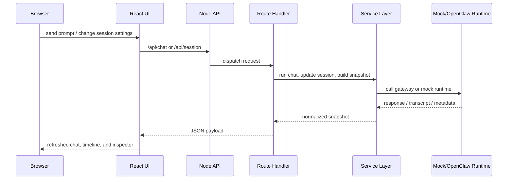

[English](../en/architecture.md) | [中文](../zh/architecture.md) | [日本語](../ja/architecture.md) | [Français](../fr/architecture.md) | [Español](../es/architecture.md) | [Português](../pt/architecture.md)

# 架构概览

> 导航：[文档首页](./documentation.md) | [快速开始](./documentation-quick-start.md) | [界面总览](./documentation-interface.md) | [产品演示指南](./showcase.md) | [重构路线图](./refactor-roadmap.md)

LalaClaw 采用“薄入口 + 可测试中间层”的结构，前端入口和后端入口都尽量保持轻量。

## 前端

- `src/App.jsx` 是页面外壳
- `src/features/app/controllers/` 负责页面级编排
- `src/features/chat/controllers/` 负责输入框和聊天执行流
- `src/features/session/runtime/` 负责运行时轮询和快照同步
- `src/features/*/storage`、`state`、`utils` 负责持久化与纯函数逻辑

## 后端

- `server.js` 启动应用并委托给组装好的上下文
- `server/core/` 负责运行配置和会话存储基础能力
- `server/routes/` 负责 API 请求处理
- `server/services/` 负责 OpenClaw 传输、transcript 投影和 dashboard 组装
- `server/formatters/` 负责纯解析和格式化逻辑
- `server/http/` 负责底层 HTTP 辅助函数

## 请求流

## 质量保障

- ESLint 是默认静态检查
- Vitest 覆盖 UI hooks、组件、routes、services 和 formatters
- CI 中运行覆盖率阈值检查
- `mock` 模式是本地和自动化测试的默认安全路径
